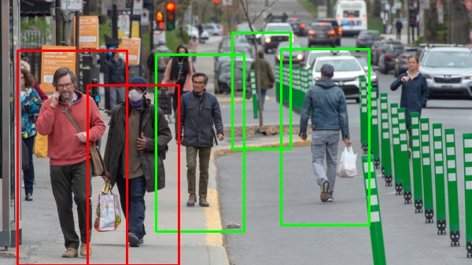
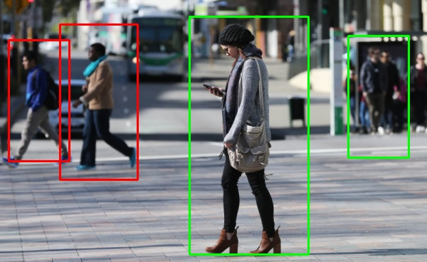

# Social-Distancing-Alert-with-OpenCV
In this notebook, we use OpenCV HOGDescriptor to detect people, calculate their distances from each other, and alert if they are close enough.

First of all, I want to thank Adrian Rosebrock (https://www.pyimagesearch.com/)

I alert two people if
1) They are closer and 1/6 of input image width
2) Their y-coordinates are closer than 1/10 of input image height

so this is the main steps:
1) find people using OpenCV HOGDescriptor
2) apply non-maxima suppression to the bounding boxes
3) calculate the center of each bounding box of detected people
4) check the distance of people
5) draw red bounding boxes for who are close to each other

